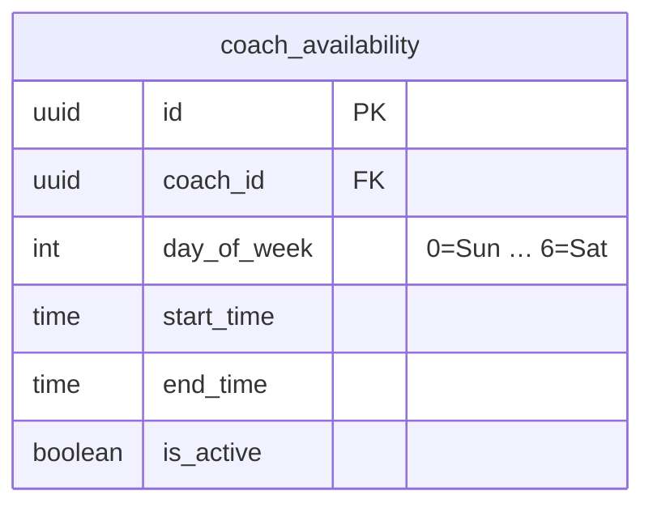
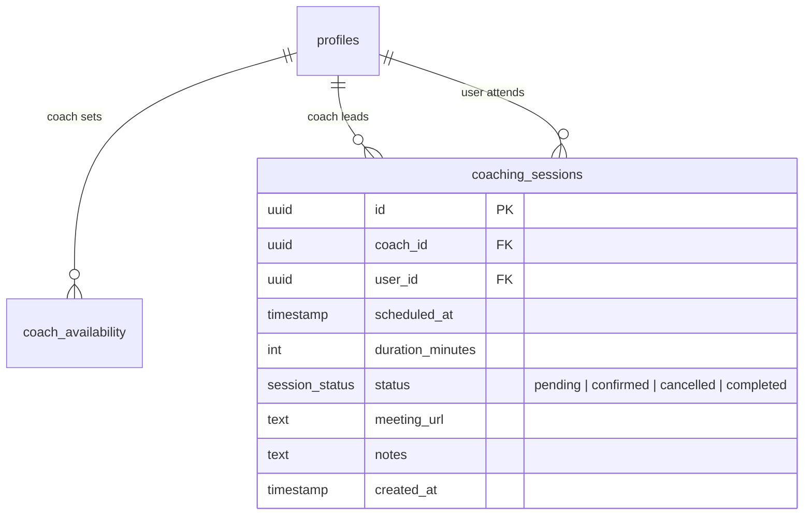

# Coaching Sessions & Coach Availability Tables

## Coach Availability

Coaches define their recurring weekly availability. Day 0 = Sunday, Day 6 = Saturday.

## Coaching Sessions

One-on-one sessions booked between a user and a coach.

## Notes

- A booking system should check `coach_availability` before inserting a `coaching_session`.
- `meeting_url` is provided by the coach after confirmation.
- `status = completed` is set after the session ends.
