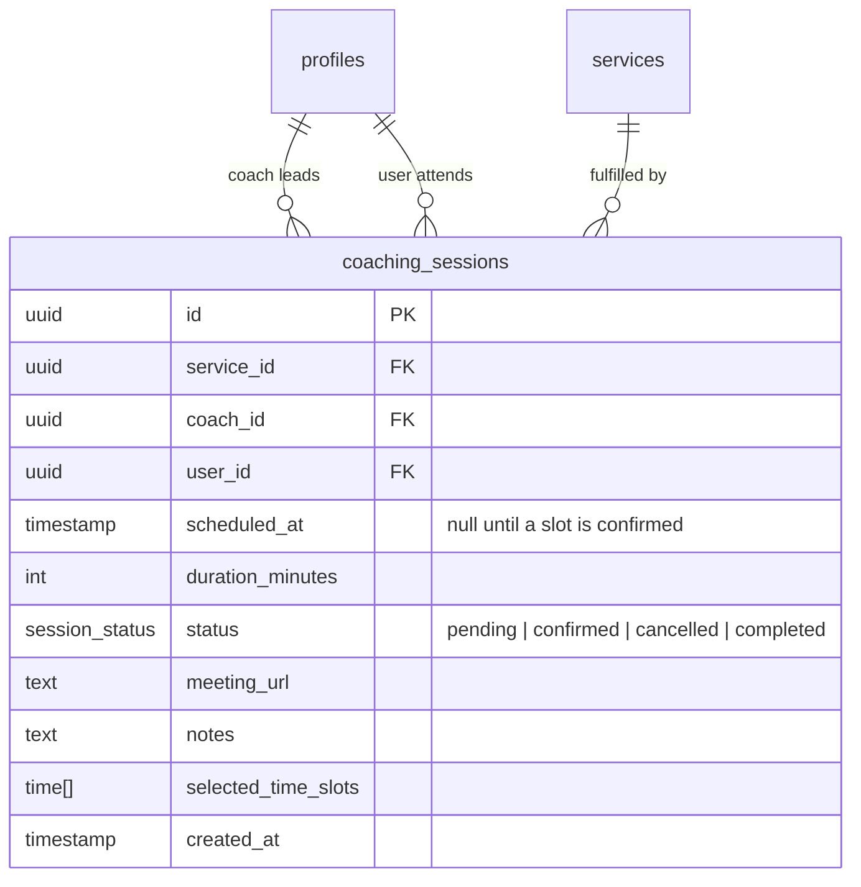

# Coaching Sessions Table

One-on-one sessions booked between a user and a coach. Linked to a `coaching_session`-type entry in `services`.

## Notes

- `scheduled_at` is null by default — it is set once the user selects a specific slot from `selected_time_slots`.
- `selected_time_slots` holds the time options offered to the user before a slot is confirmed.
- `meeting_url` is provided by the coach after confirmation.
- `status = completed` is set after the session ends.
- Coach availability is not managed by a separate table — coaches do not set recurring availability.
