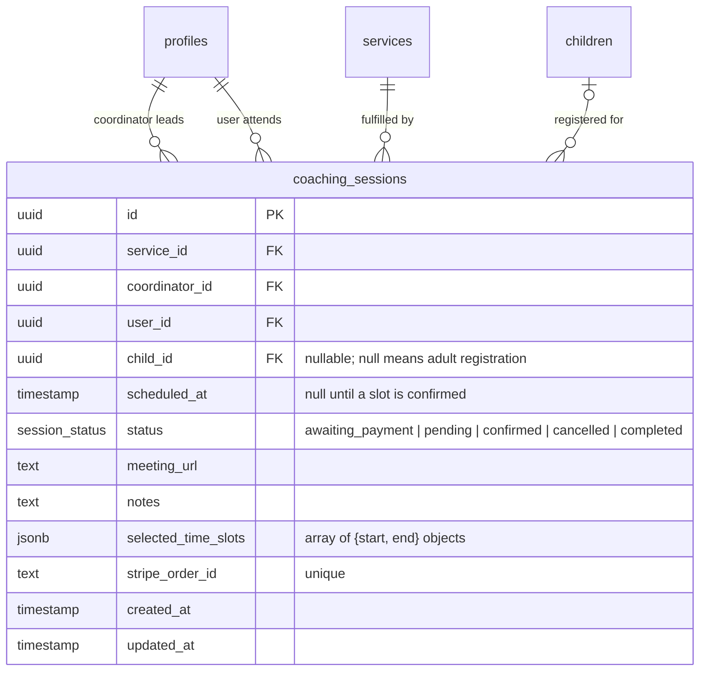

# Coaching Sessions Table

One-on-one sessions booked between a user and a coordinator. Each session is linked
to a `private_lessons`-type entry in `services`.

```mermaid
erDiagram
    coaching_sessions {
        uuid id PK
        uuid service_id FK
        uuid coordinator_id FK
        uuid user_id FK
        uuid child_id FK "nullable; null means adult registration"
        timestamp scheduled_at "null until a slot is confirmed"
        session_status status "awaiting_payment | pending | confirmed | cancelled | completed"
        text meeting_url
        text notes
        jsonb selected_time_slots "array of {start, end} objects"
        text stripe_order_id "unique"
        timestamp created_at
        timestamp updated_at
    }

    profiles ||--o{ coaching_sessions : "coordinator leads"
    profiles ||--o{ coaching_sessions : "user attends"
    services ||--o{ coaching_sessions : "fulfilled by"
    children |o--o{ coaching_sessions : "registered for"
```

## Notes

- `coordinator_id` references the `profiles` row of the coordinator leading the session;
  `user_id` is the attending user. `child_id` is set when the session is booked on behalf
  of a child (null for adult registrations).
- `scheduled_at` is null by default — it is set once a specific slot is confirmed from
  `selected_time_slots`.
- `selected_time_slots` is a **required** JSON array of `{ start, end }` objects (ISO 8601
  strings) representing the availability windows the user offered when requesting the
  session, e.g. `[{ "start": "2026-04-14T14:00:00Z", "end": "2026-04-14T17:00:00Z" }]`.
- `meeting_url` is provided after the session is confirmed.
- `stripe_order_id` links the session to its Stripe payment (unique).
- `status = completed` is set after the session ends.
