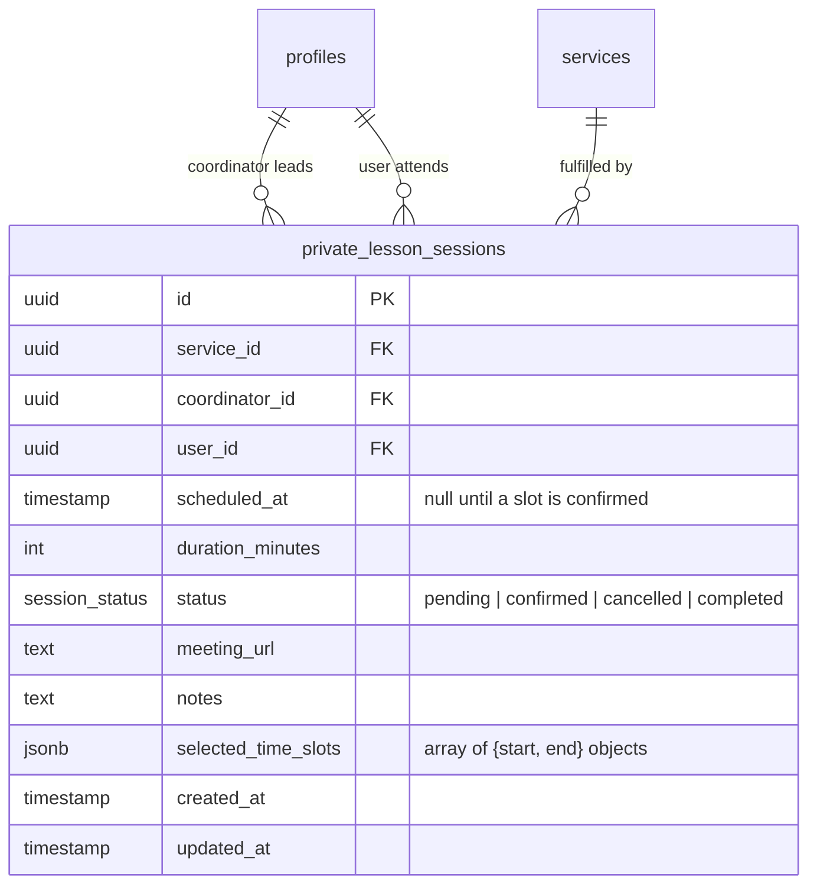

# Private Lesson Sessions Table

One-on-one sessions booked between a user and a coordinator. Linked to a
`private_lessons`-type entry in `services`.

## Notes

- `scheduled_at` is null by default — it is set once the user selects a specific slot from `selected_time_slots`.
- `selected_time_slots` is a JSON array of `{ start, end }` objects (ISO 8601 strings) representing the time options offered to the user e.g. `[{ "start": "2026-04-14T14:00:00Z", "end": "2026-04-14T17:00:00Z" }]`.
- `meeting_url` is provided by the coordinator after confirmation.
- `status = completed` is set after the session ends.
