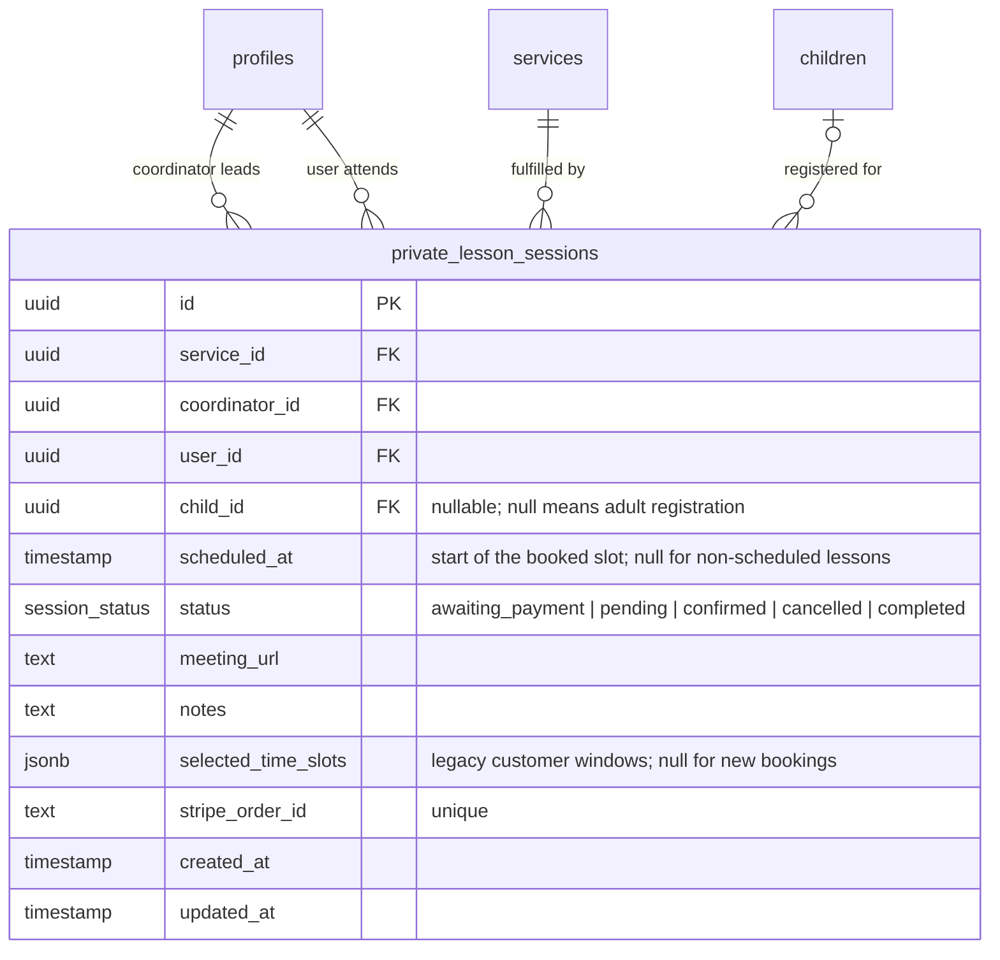

# Private Lesson Sessions Table

One-on-one sessions booked between a user and a coordinator. Each session is linked
to a `private_lessons`-type entry in `services`.

```mermaid
erDiagram
    private_lesson_sessions {
        uuid id PK
        uuid service_id FK
        uuid coordinator_id FK
        uuid user_id FK
        uuid child_id FK "nullable; null means adult registration"
        timestamp scheduled_at "start of the booked slot; null for non-scheduled lessons"
        session_status status "awaiting_payment | pending | confirmed | cancelled | completed"
        text meeting_url
        text notes
        jsonb selected_time_slots "legacy customer windows; null for new bookings"
        text stripe_order_id "unique"
        timestamp created_at
        timestamp updated_at
    }

    profiles ||--o{ private_lesson_sessions : "coordinator leads"
    profiles ||--o{ private_lesson_sessions : "user attends"
    services ||--o{ private_lesson_sessions : "fulfilled by"
    children |o--o{ private_lesson_sessions : "registered for"
```

## Notes

- `coordinator_id` references the `profiles` row of the coordinator leading the session;
  `user_id` is the attending user. `child_id` is set when the session is booked on behalf
  of a child (null for adult registrations).
- `scheduled_at` is the start of the booked lesson (UTC). **Scheduled** lessons
  (`services.is_scheduled = true`) set it at checkout; **non-scheduled** lessons leave it
  null and the coordinator arranges a time after payment.
- `selected_time_slots` holds the `{ start, end }` windows customers used to submit before
  the slot picker existed. New bookings leave it null; it is kept for older rows, and the
  booking email still lists those windows when present.

## Booking a scheduled lesson

1. **Slots.** `listBookableSlots({ serviceId, from, to })` (`app/private-lessons/actions.ts`)
   resolves the coordinator from the service, expands their weekly hours and date
   overrides (`lib/availability.ts`), and cuts each window into back-to-back slots of the
   service's `duration_minutes`, starting at the window's start. Leftover time is not
   offered. Windows are wall-clock times in the coordinator's time zone and are converted
   to real instants with daylight saving handled (`lib/booking-slots.ts`). Past slots and
   slots overlapping any lesson the coordinator already has, **across all their services**,
   are removed. That includes unpaid holds that haven't gone stale.
2. **Hold.** On "Continue to payment", `reservePrivateLessonSession` re-validates the slot
   and inserts the `awaiting_payment` row with `scheduled_at` set, in one transaction that
   first locks the coordinator's `profiles` row (`SELECT … FOR UPDATE`). Concurrent bookings
   for the same coordinator run one after another, so two customers can't take overlapping
   times. The loser gets `code: "slot_taken"` and is asked to pick again.
3. **Payment window.** The Stripe Checkout Session gets `expires_at` 31 minutes out
   (`CHECKOUT_EXPIRY_MINUTES`). An `awaiting_payment` row older than `HOLD_MINUTES` (36)
   no longer blocks its slot, even if the expiry webhook never arrives.
4. **Webhook.** `checkout.session.completed` sets a scheduled lesson to `confirmed` (a
   non-scheduled one to `pending`) and emails the coordinator the booked time, shown in
   their availability time zone. `checkout.session.expired` sets the unpaid row to
   `cancelled`, releasing the slot. **The Stripe webhook endpoint must be subscribed to
   `checkout.session.expired`.**

Changing a coordinator's availability never moves or cancels lessons that are already
booked; it only changes what can be booked from then on.

## Other notes

- `meeting_url` is provided after the session is confirmed.
- `stripe_order_id` links the session to its Stripe payment (unique).
- `status = completed` is set after the session ends.
