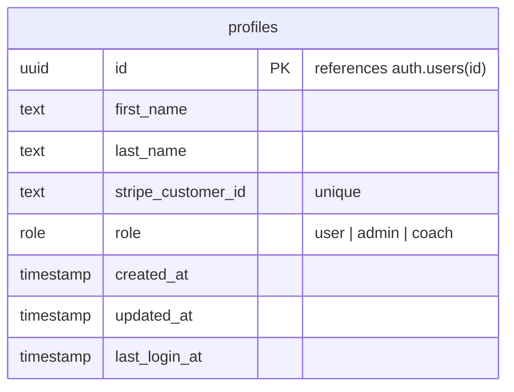

# Profiles Table

Mirrors Supabase `auth.users` — populated via a database trigger on signup. Stores display data and the user's role within the platform. The last_login_at property is updated via a Server Action every time a user logs in.

## Notes

- `id` is **not** auto-generated — it is set to the corresponding `auth.users.id` from Supabase Auth.
- `role` controls access: `user` is a regular member, `coach` can manage and lead sessions, `admin` has full access.
