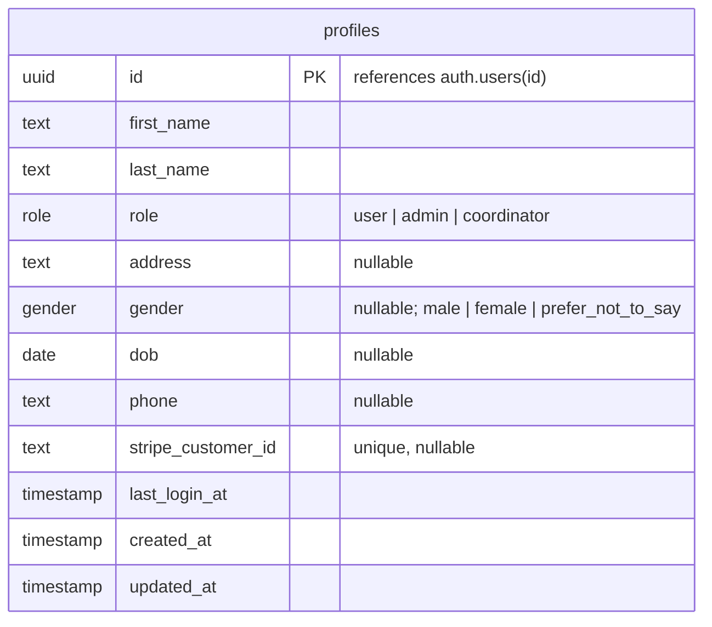

# Profiles Table

Mirrors Supabase `auth.users` — populated via a database trigger on signup. Stores display data, contact details, and the user's role within the platform. `last_login_at` is updated via a Server Action every time a user logs in.

```mermaid
erDiagram
    profiles {
        uuid id PK "references auth.users(id)"
        text first_name
        text last_name
        role role "user | admin | coordinator"
        text address "nullable"
        gender gender "nullable; male | female | prefer_not_to_say"
        date dob "nullable"
        text phone "nullable"
        text stripe_customer_id "unique, nullable"
        timestamp last_login_at
        timestamp created_at
        timestamp updated_at
    }
```

## Notes

- `id` is **not** auto-generated — it is set to the corresponding `auth.users.id` from Supabase Auth.
- `role` controls access (defaults to `user`): `user` is a regular member, `coordinator` can manage and lead services/coaching sessions, `admin` has full access. Values are also defined in `lib/roles.ts`.
- `first_name` and `last_name` are required; `address`, `gender`, `dob`, and `phone` are optional profile details.
- `stripe_customer_id` links the profile to its Stripe customer once created; it is unique.
- RLS is enabled with no policies. `custom_access_token_hook` still reads `role` into the `user_role` JWT claim because it's `security definer`. See [Row Level Security](./schema-overview.md#row-level-security).
- The signup trigger (`handle_new_user`) and the access token hook are defined in [`lib/db/auth-functions.sql`](../lib/db/auth-functions.sql).
