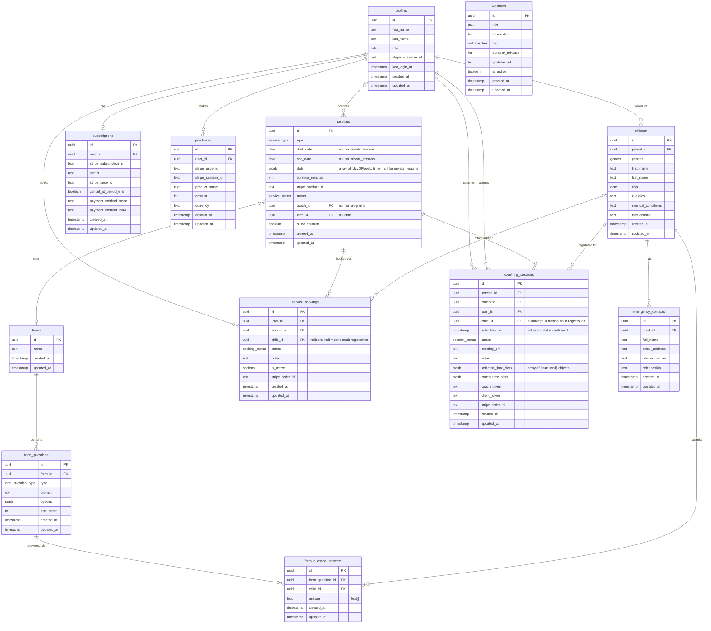

# MCLD Platform — Full Schema Overview

## Indexes

| Table | Index | Type | Condition |
|---|---|---|---|
| `service_bookings` | `service_bookings_service_id_child_id_idx` | Unique (partial) | `WHERE child_id IS NOT NULL` — prevents the same child from registering for the same program twice |

## Enums

| Enum | Values |
|---|---|
| `role` | `user`, `admin`, `coach` |
| `service_type` | `private_lessons`, `programs` |
| `service_status` | `active`, `disabled`, `archived`, `deleted` |
| `booking_status` | `awaiting_payment`, `pending`, `confirmed`, `cancelled` |
| `session_status` | `awaiting_payment`, `pending`, `confirmed`, `cancelled`, `completed` |
| `webinar_tier` | `free`, `premium` |
| `gender` | `male`, `female`, `prefer_not_to_say` |
| `form_question_type` | `text`, `multiple_choices`, `checkboxes`, `user_agreement` |
