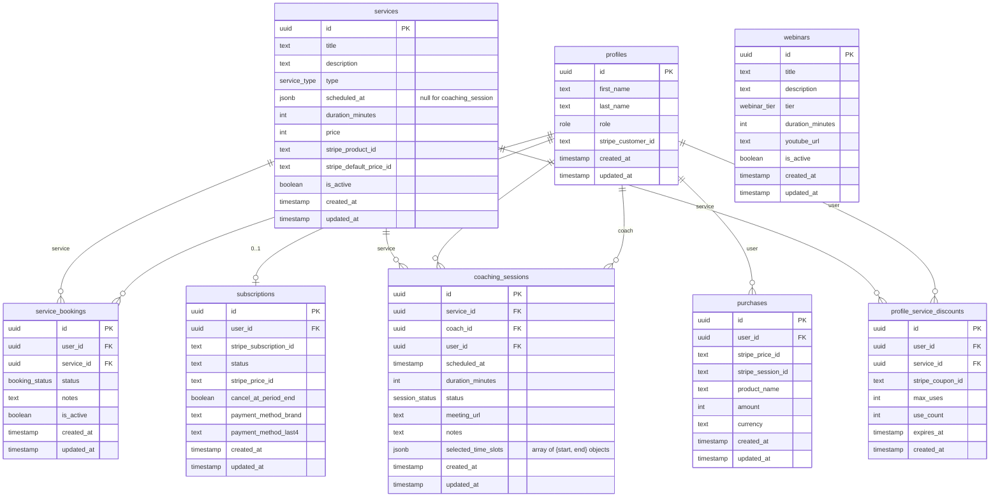

# MCLD Platform — Full Schema Overview

<!-- Generated by scripts/generate-schema-overview.ts — do not edit by hand; run npm run docs:schema -->

## Enums

| Enum | Values |
|---|---|
| `booking_status` | `pending`, `confirmed`, `cancelled` |
| `role` | `user`, `admin`, `coach` |
| `service_type` | `coaching_session`, `booking` |
| `session_status` | `pending`, `confirmed`, `cancelled`, `completed` |
| `webinar_tier` | `free`, `premium` |
