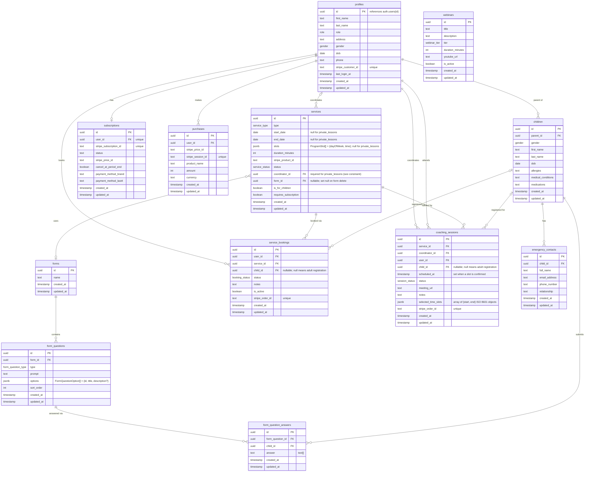

# MCLD Platform — Full Schema Overview

```mermaid
erDiagram
    profiles {
        uuid id PK "references auth.users(id)"
        text first_name
        text last_name
        role role
        text address
        gender gender
        date dob
        text phone
        text stripe_customer_id "unique"
        timestamp last_login_at
        timestamp created_at
        timestamp updated_at
    }

    forms {
        uuid id PK
        text name
        timestamp created_at
        timestamp updated_at
    }

    services {
        uuid id PK
        service_type type
        date start_date "null for private_lessons"
        date end_date "null for private_lessons"
        jsonb slots "ProgramSlot[] = {dayOfWeek, time}; null for private_lessons"
        int duration_minutes
        text stripe_product_id
        service_status status
        uuid coordinator_id FK "required for private_lessons (see constraint)"
        uuid form_id FK "nullable; set null on form delete"
        boolean is_for_children
        boolean requires_subscription
        timestamp created_at
        timestamp updated_at
    }

    service_bookings {
        uuid id PK
        uuid user_id FK
        uuid service_id FK
        uuid child_id FK "nullable; null means adult registration"
        booking_status status
        text notes
        boolean is_active
        text stripe_order_id "unique"
        timestamp created_at
        timestamp updated_at
    }

    webinars {
        uuid id PK
        text title
        text description
        webinar_tier tier
        int duration_minutes
        text youtube_url
        boolean is_active
        timestamp created_at
        timestamp updated_at
    }

    coaching_sessions {
        uuid id PK
        uuid service_id FK
        uuid coordinator_id FK
        uuid user_id FK
        uuid child_id FK "nullable; null means adult registration"
        timestamp scheduled_at "set when a slot is confirmed"
        session_status status
        text meeting_url
        text notes
        jsonb selected_time_slots "array of {start, end} ISO 8601 objects"
        text stripe_order_id "unique"
        timestamp created_at
        timestamp updated_at
    }

    subscriptions {
        uuid id PK
        uuid user_id FK "unique"
        text stripe_subscription_id "unique"
        text status
        text stripe_price_id
        boolean cancel_at_period_end
        text payment_method_brand
        text payment_method_last4
        timestamp created_at
        timestamp updated_at
    }

    purchases {
        uuid id PK
        uuid user_id FK
        text stripe_price_id
        text stripe_session_id "unique"
        text product_name
        int amount
        text currency
        timestamp created_at
        timestamp updated_at
    }

    children {
        uuid id PK
        uuid parent_id FK
        gender gender
        text first_name
        text last_name
        date dob
        text allergies
        text medical_conditions
        text medications
        timestamp created_at
        timestamp updated_at
    }

    emergency_contacts {
        uuid id PK
        uuid child_id FK
        text full_name
        text email_address
        text phone_number
        text relationship
        timestamp created_at
        timestamp updated_at
    }

    form_questions {
        uuid id PK
        uuid form_id FK
        form_question_type type
        text prompt
        jsonb options "FormQuestionOption[] = {id, title, description?}"
        int sort_order
        timestamp created_at
        timestamp updated_at
    }

    form_question_answers {
        uuid id PK
        uuid form_question_id FK
        uuid child_id FK
        text answer "text[]"
        timestamp created_at
        timestamp updated_at
    }

    profiles ||--o{ service_bookings : "books"
    services ||--o{ service_bookings : "booked via"
    children |o--o{ service_bookings : "registered for"
    profiles ||--o{ coaching_sessions : "coordinates"
    profiles ||--o{ coaching_sessions : "attends"
    services ||--o{ coaching_sessions : "fulfilled by"
    children |o--o{ coaching_sessions : "registered for"
    profiles ||--o{ children : "parent of"
    children ||--o{ emergency_contacts : "has"
    profiles ||--o| subscriptions : "has"
    profiles ||--o{ purchases : "makes"
    profiles |o--o{ services : "coordinates"
    forms ||--o{ form_questions : "contains"
    services }o--o| forms : "uses"
    form_questions ||--o{ form_question_answers : "answered via"
    children ||--o{ form_question_answers : "submits"
```

## Per-table docs

| Table(s) | Doc |
|---|---|
| `profiles` | [profiles.md](./profiles.md) |
| `services`, `service_bookings` | [services.md](./services.md) |
| `coaching_sessions` | [coaching.md](./coaching.md) |
| `webinars` | [webinars.md](./webinars.md) |

Tables without a dedicated doc (`forms`, `form_questions`, `form_question_answers`,
`children`, `emergency_contacts`, `subscriptions`, `purchases`) are covered by the
ER diagram above.

## Enums

| Enum | Values |
|---|---|
| `role` | `user`, `admin`, `coordinator` |
| `service_type` | `private_lessons`, `programs` |
| `service_status` | `active`, `archived`, `deleted`, `disabled` |
| `booking_status` | `awaiting_payment`, `pending`, `confirmed`, `cancelled` |
| `session_status` | `awaiting_payment`, `pending`, `confirmed`, `cancelled`, `completed` |
| `webinar_tier` | `free`, `premium` |
| `gender` | `male`, `female`, `prefer_not_to_say` |
| `form_question_type` | `text`, `multiple_choices`, `checkboxes`, `user_agreement` |

## Constraints

| Table | Constraint | Rule |
|---|---|---|
| `services` | `services_private_lessons_require_coordinator` (CHECK) | A `private_lessons` service must have a `coordinator_id`. Other types may leave it null. |

## Indexes

| Table | Index | Type | Condition |
|---|---|---|---|
| `service_bookings` | `service_bookings_service_id_child_id_idx` | Unique (partial) | `WHERE child_id IS NOT NULL` — prevents the same child from registering for the same service twice |

## JSONB shapes

Some `jsonb` columns store typed structures defined in `lib/db/schema.ts`:

| Column | Shape | Notes |
|---|---|---|
| `services.slots` | `ProgramSlot[]` — `{ dayOfWeek: number; time: string }` | Recurring weekly slots for `programs`; null for `private_lessons`. |
| `coaching_sessions.selected_time_slots` | `{ start: string; end: string }[]` | ISO 8601 windows the user offered when requesting a session. Not `$type`-annotated in the schema. |
| `form_questions.options` | `FormQuestionOption[]` — `{ id: string; title: string; description?: string }` | Choices for `multiple_choices` / `checkboxes` questions; null for other types. |

## Row Level Security

RLS is enabled on every table. The app reads and writes through Drizzle (`lib/db`),
which connects as `postgres` and bypasses RLS, so RLS only affects the Supabase Data
API (the `anon` / `authenticated` roles behind the publishable key). There are no
policies, so the Data API returns no rows and rejects writes on every table.

`custom_access_token_hook` also reads `profiles` (to copy `role` into the
`user_role` JWT claim). Supabase Auth calls it as `supabase_auth_admin`, which
doesn't bypass RLS, so the hook is `security definer`: it runs as its owner
(`postgres`) and needs no policy. See [Auth functions](#auth-functions).

**Don't rely on `db:push` for policies.** drizzle-kit's `push` drops a
`pgPolicy`'s `using` / `withCheck` when it creates the policy, and ignores them
when comparing, so it never repairs them. A permissive policy with no `USING`
clause lets no rows through. If policies are ever needed, apply them with
`db:generate` + `db:migrate`, or check them in the database after pushing.

## Auth functions

[`lib/db/auth-functions.sql`](../lib/db/auth-functions.sql) holds the database
functions Supabase Auth relies on. Drizzle doesn't manage functions or triggers,
so run the file in the Supabase SQL editor after the first `db:push` on a new
database, and again whenever it changes. It's safe to re-run.

| Function | Trigger / hook | What it does |
|---|---|---|
| `custom_access_token_hook` | Auth hook "Customize Access Token (JWT) Claims" (enable it under **Authentication > Hooks**) | Copies `profiles.role` into the `user_role` JWT claim on every login and token refresh. Only `supabase_auth_admin` can execute it. |
| `handle_new_user` | `on_auth_user_created`, after insert on `auth.users` | Creates the matching `profiles` row with role `user`. |

## Working with the schema

- **`lib/db/schema.ts` is the single source of truth.** The Drizzle config
  (`drizzle.config.ts`) points at it, and all app code imports from it. This doc,
  the ER diagram, and the migration files are all derived from it.
- **Naming convention:** columns are `snake_case` in Postgres and `camelCase` in
  the Drizzle/TypeScript layer (e.g. `coordinator_id` ↔ `coordinatorId`). Keep both
  in sync when adding columns.
- **Changing the schema — two workflows:**
  - `pnpm db:push` — applies `schema.ts` directly to the database. Fast, good for
    local prototyping; does **not** create a migration file.
  - `pnpm db:generate` then `pnpm db:migrate` — generates a versioned SQL migration
    under `drizzle/` and applies it. Use this for changes that ship to shared/prod
    environments.
  - Pick one workflow per change; don't run `db:push` and `db:migrate` against the
    same environment expecting them to reconcile.
- **Every table enables RLS:** end each `pgTable(...)` with `.enableRLS()`. Drizzle
  tracks RLS per table, so turning it on only in the Supabase dashboard gets undone
  by the next `db:push`. Only add `anon` / `authenticated` policies if the browser
  starts querying tables through `supabase-js`.
- `pnpm db:studio` opens Drizzle Studio to inspect data.
- **Keep the docs in sync:** the ER diagram and enum/constraint tables above are
  hand-maintained. Update them (and the relevant per-table doc) in the same PR as
  any `schema.ts` change.
