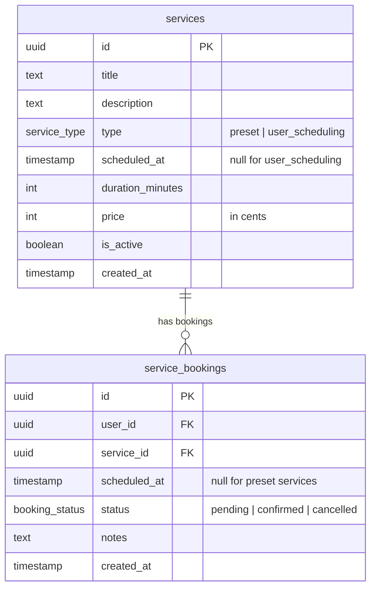

# Services & Service Bookings Tables

## Services

Represents offerings on the platform. Two types:
- **`preset`** — fixed date/time set by admin; `scheduled_at` is populated.
- **`user_scheduling`** — user picks their own slot; `scheduled_at` on the service is null, the chosen time is on `service_bookings.scheduled_at`.

## Notes

- `price` is stored in **cents** (integer) to avoid floating-point issues.
- `is_active = false` hides a service without deleting historical bookings.
