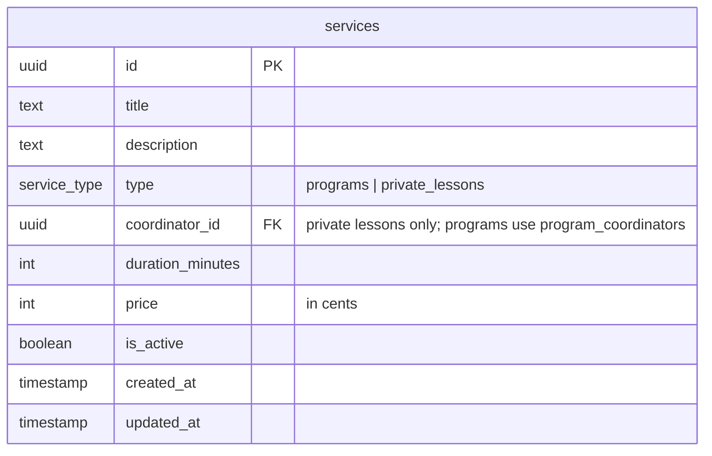
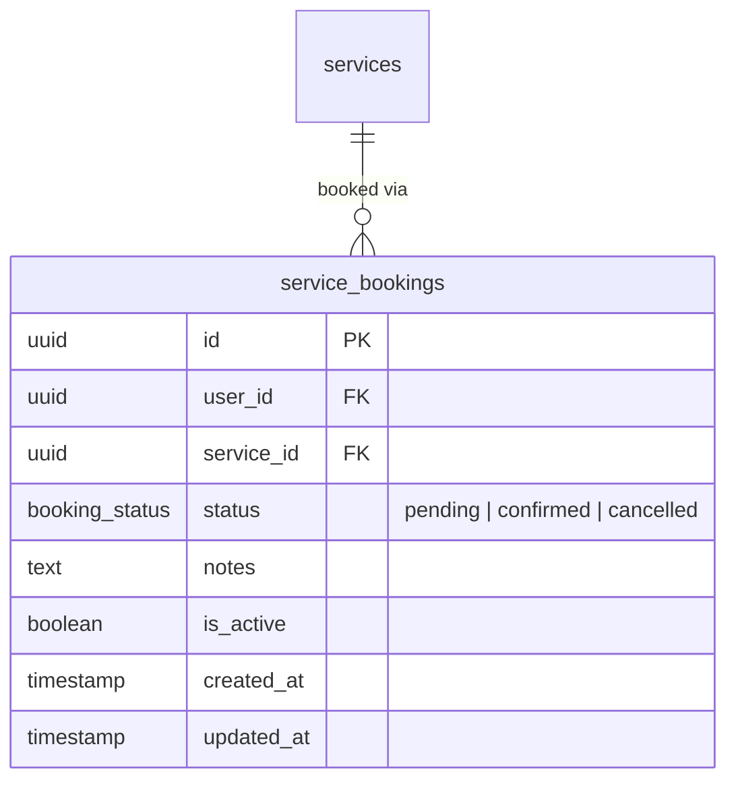

# Services & Service Bookings Tables

## Services

The central catalog of offerings on the platform. Two types:
- **`programs`** — a scheduled offering with a weekly recurring schedule (`slots`) over a `start_date`/`end_date` range. One or more coordinators are assigned via the `program_coordinators` join table.
- **`private_lessons`** — a one-on-one offering where the user proposes availability. Timing is handled through the `private_lesson_sessions` table, and a single coordinator is assigned via `services.coordinator_id`.

## Service Bookings

A user's purchase of a booking-type service.

## Notes

- `price` is stored in **cents** (integer) to avoid floating-point issues.
- `is_active = false` hides a service without deleting historical bookings.
- `scheduled_at` is a JSON array of `{ start, end }` ISO 8601 objects e.g. `[{ "start": "2026-04-15T14:00:00Z", "end": "2026-04-15T16:00:00Z" }]`.
