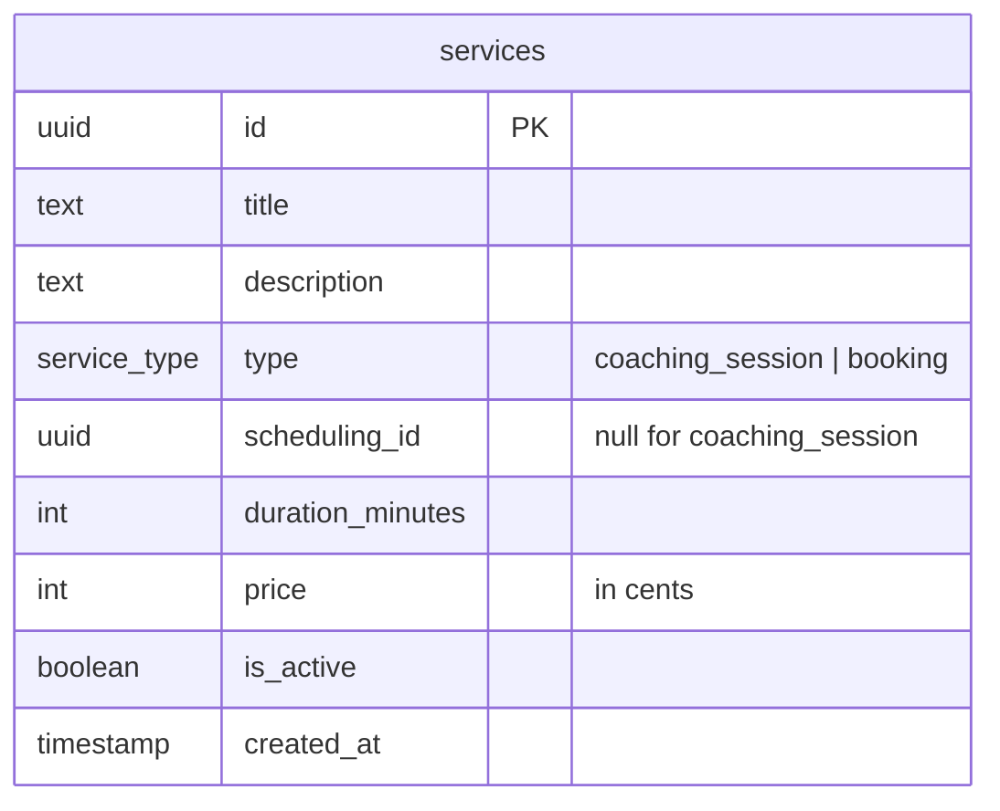
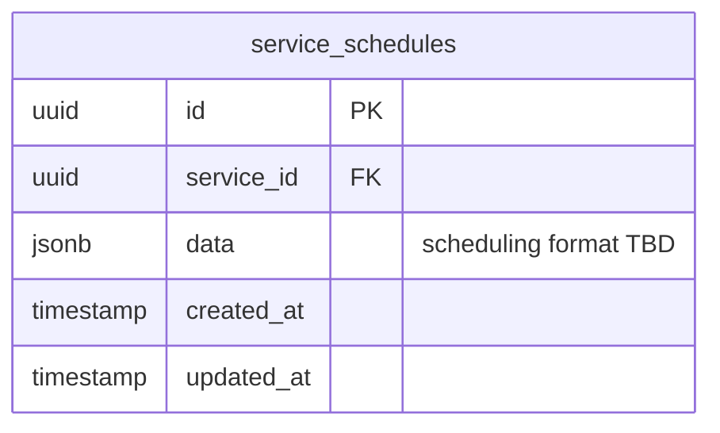
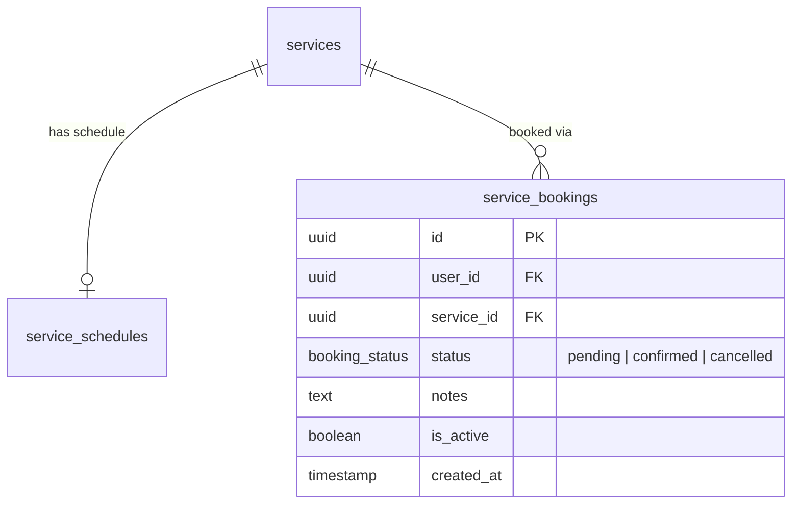

# Services, Schedules & Service Bookings Tables

## Services

The central catalog of offerings on the platform. Two types:
- **`booking`** — a bookable service; has an associated `service_schedules` row (via `scheduling_id`).
- **`coaching_session`** — a coaching offering; `scheduling_id` is null — the scheduling is handled through the `coaching_sessions` table.

## Service Schedules

Holds the scheduling data for `booking`-type services. Format of `data` is TBD.

## Service Bookings

A user's booking of a service.

## Notes

- `price` is stored in **cents** (integer) to avoid floating-point issues.
- `is_active = false` hides a service without deleting historical bookings.
- `scheduling_id` is a soft reference to `service_schedules.id` — cascade is handled from `service_schedules.service_id → services.id`.
