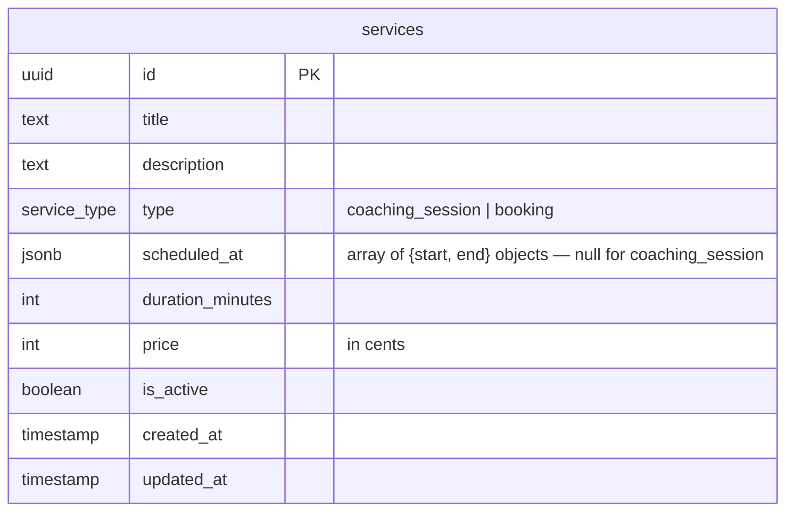
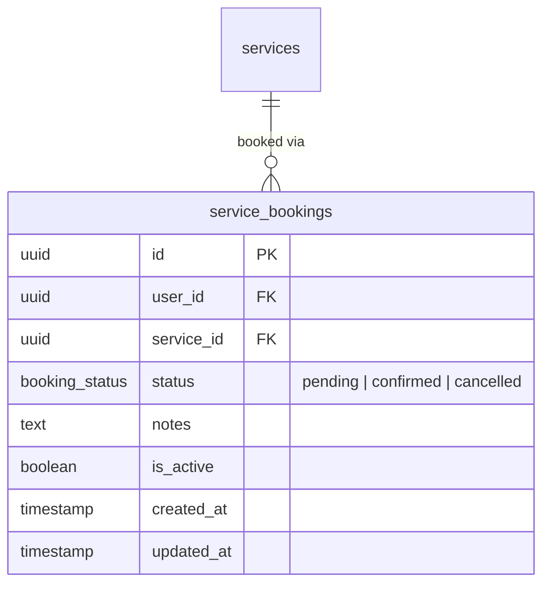

# Services & Service Bookings Tables

## Services

The central catalog of offerings on the platform. Two types:
- **`booking`** — a fixed event with predetermined time slots set by the admin. Users buy it like a product with no input on timing. `scheduled_at` holds the time slots as a JSON array.
- **`coaching_session`** — a coaching offering where the user proposes availability. `scheduled_at` is null — timing is handled through the `coaching_sessions` table.

## Service Bookings

A user's purchase of a booking-type service.

## Notes

- `price` is stored in **cents** (integer) to avoid floating-point issues.
- `is_active = false` hides a service without deleting historical bookings.
- `scheduled_at` is a JSON array of `{ start, end }` ISO 8601 objects e.g. `[{ "start": "2026-04-15T14:00:00Z", "end": "2026-04-15T16:00:00Z" }]`.
