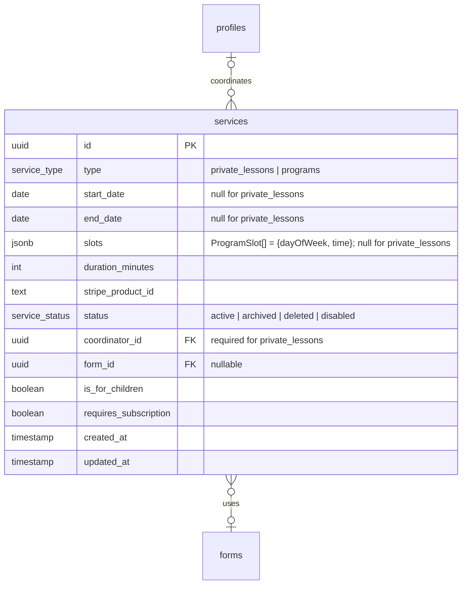
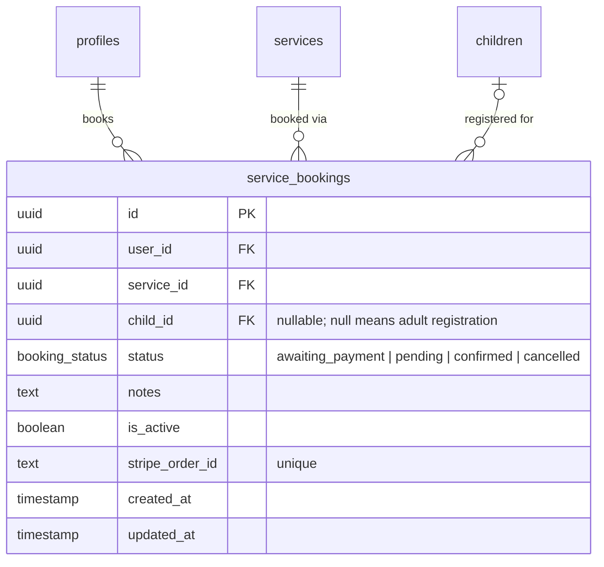

# Services & Service Bookings Tables

## Services

The central catalog of offerings on the platform. Two types (`service_type`):

- **`private_lessons`** — one-on-one coaching led by a coordinator. The user proposes availability and scheduling is handled through the `coaching_sessions` table. A coordinator is **required** (enforced by a check constraint).
- **`programs`** — recurring group offerings with a fixed schedule. `slots` holds the recurring weekly times, and `start_date`/`end_date` bound the program.

```mermaid
erDiagram
    services {
        uuid id PK
        service_type type "private_lessons | programs"
        date start_date "null for private_lessons"
        date end_date "null for private_lessons"
        jsonb slots "ProgramSlot[] = {dayOfWeek, time}; null for private_lessons"
        int duration_minutes
        text stripe_product_id
        service_status status "active | archived | deleted | disabled"
        uuid coordinator_id FK "required for private_lessons"
        uuid form_id FK "nullable"
        boolean is_for_children
        boolean requires_subscription
        timestamp created_at
        timestamp updated_at
    }

    profiles |o--o{ services : "coordinates"
    services }o--o| forms : "uses"
```

## Service Bookings

A user's enrollment in a service. For `programs` this represents a seat; for
`private_lessons` the scheduling detail lives in `coaching_sessions`.

```mermaid
erDiagram
    service_bookings {
        uuid id PK
        uuid user_id FK
        uuid service_id FK
        uuid child_id FK "nullable; null means adult registration"
        booking_status status "awaiting_payment | pending | confirmed | cancelled"
        text notes
        boolean is_active
        text stripe_order_id "unique"
        timestamp created_at
        timestamp updated_at
    }

    profiles ||--o{ service_bookings : "books"
    services ||--o{ service_bookings : "booked via"
    children |o--o{ service_bookings : "registered for"
```

## Notes

- **`coordinator_id` is required for `private_lessons`** — enforced by the
  `services_private_lessons_require_coordinator` check constraint. It may be null
  for `programs`. Deleting a referenced coordinator is restricted (`onDelete: restrict`).
- `slots` is a JSON array of `ProgramSlot` objects (`{ dayOfWeek: number; time: string }`)
  describing the recurring weekly schedule of a program. It is null for `private_lessons`.
- `stripe_product_id` links the service to its Stripe product (required). Pricing lives
  in Stripe, not in this table.
- `status` controls visibility/lifecycle: `active` is live; `disabled` hides it
  temporarily; `archived`/`deleted` retire it without dropping historical bookings.
- `is_for_children` marks services booked on behalf of a child (via `child_id` on the booking).
- `requires_subscription` (default `true`) gates the service behind an active subscription.
- `form_id` optionally attaches an intake form (see `forms` / `form_questions`); it is
  set to null if the form is deleted.
- **Bookings:** `child_id` is null for adult registrations. A partial unique index
  (`service_bookings_service_id_child_id_idx`) prevents the same child from being
  registered for the same service twice. `stripe_order_id` links the booking to its
  Stripe payment. `is_active = false` hides a booking without deleting history.
