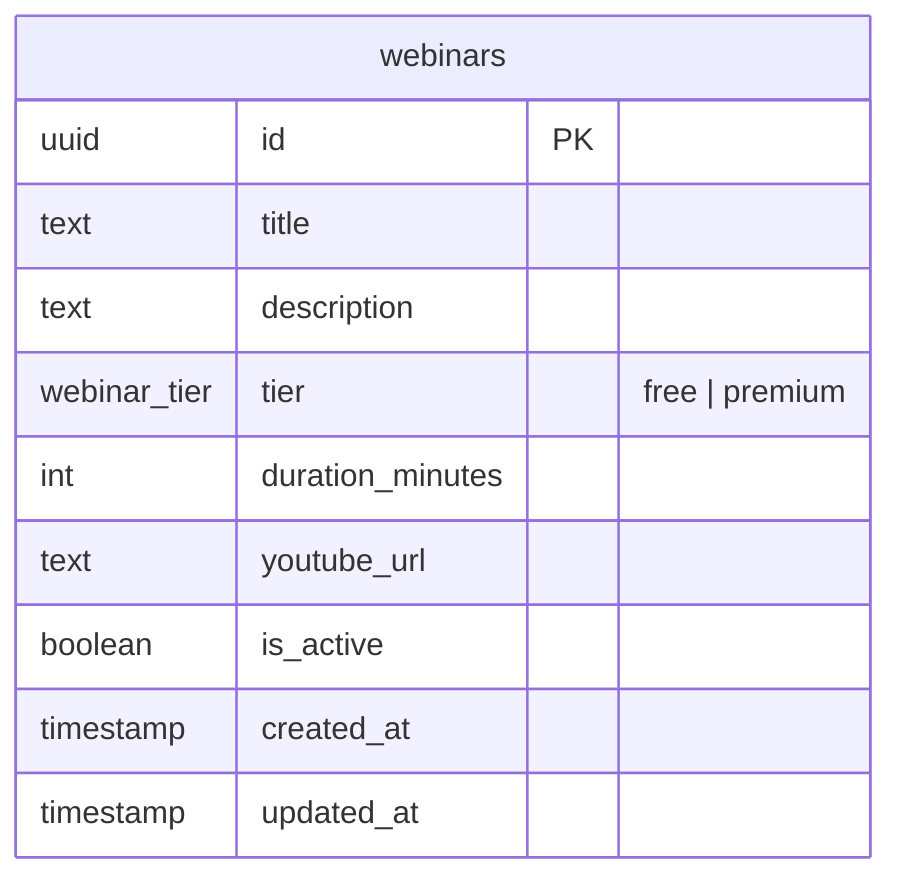

# Webinars Table

Online video content hosted on the platform. Two tiers:
- **`free`** — accessible to all users.
- **`premium`** — accessible to active subscribers only.

## Notes

- Access is determined by the user's subscription status, not registration — there is no sign-up flow.
- `youtube_url` is the link to the YouTube video.
- `is_active = false` hides a webinar without deleting it.
