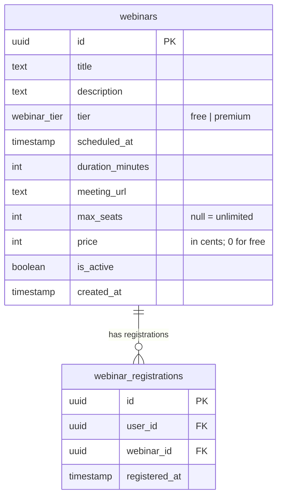

# Webinars & Webinar Registrations Tables

## Webinars

Online events that platform members can register for. Two tiers:
- **`free`** — open to all users; `price` is `0`.
- **`premium`** — requires payment; `price` > `0`.

## Notes

- `max_seats = null` means unlimited capacity.
- `meeting_url` can be a Zoom/Google Meet link, added before the event starts.
- `is_active = false` hides a webinar without losing registration history.
